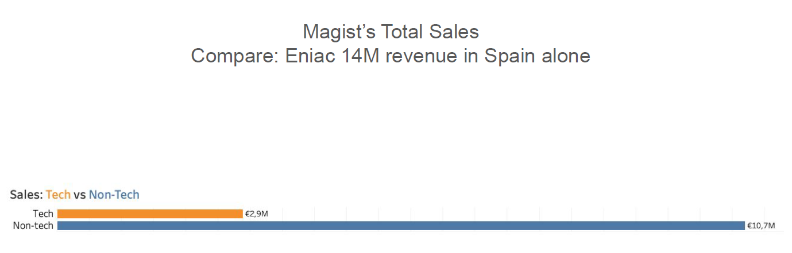
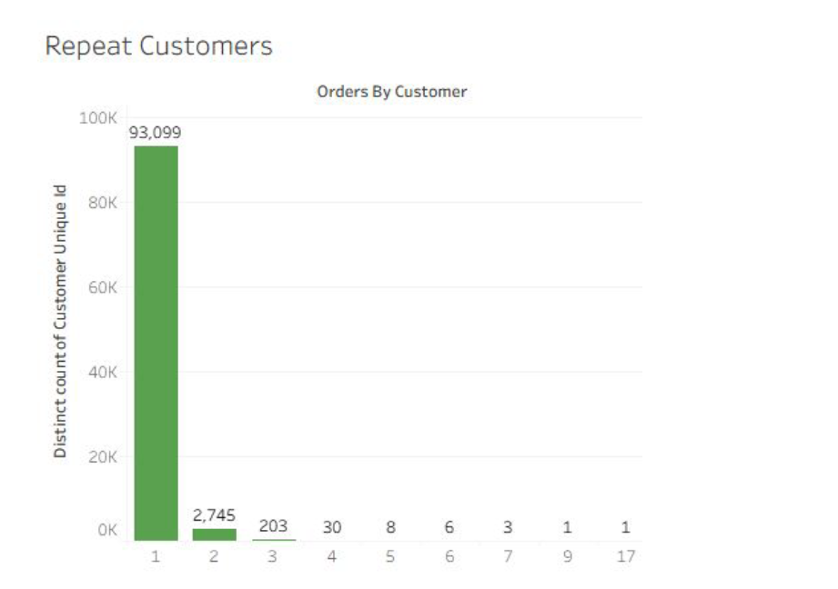
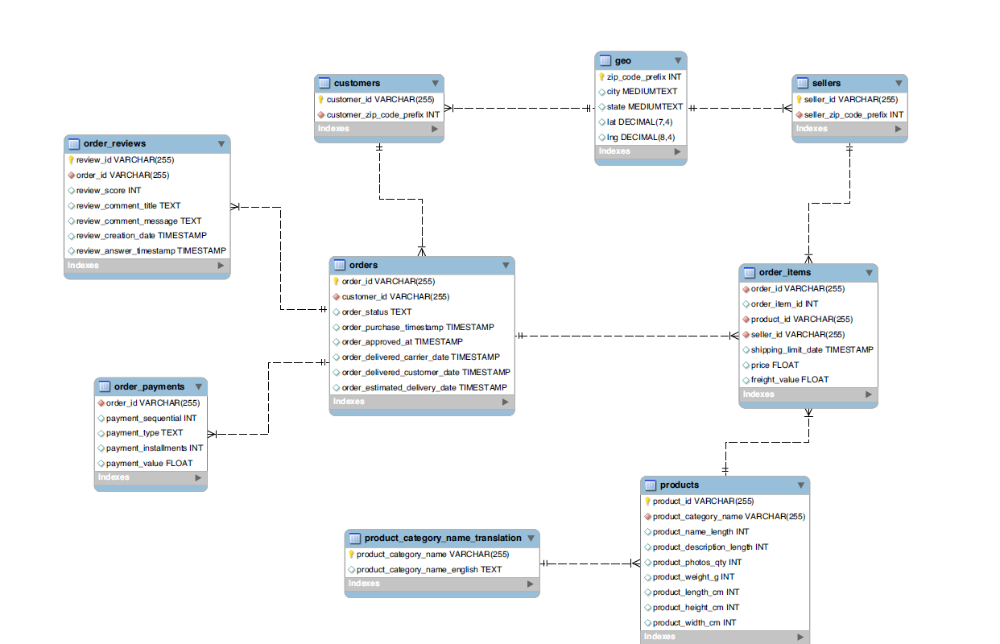

# Magist x Eniac: Partnership Analysis

📊 **[Interactive dashboard on Tableau Public](https://public.tableau.com/views/MagistAnalysis_17864646285000/MagistAnalysisandLink)**

Eniac, a Spanish online retailer of Apple-compatible tech, wants to enter the Brazilian market. Magist, a Brazilian e-commerce marketplace, is offering a partnership. Is Magist the right partner?

A WBS Coding School bootcamp project done in a small group, and my first real work with SQL.

## The questions
- **Market fit:** Does Magist already sell tech, and does it sell expensive tech?
- **Scale:** Is Magist big enough for Eniac, and how much do its tech sellers earn?
- **Logistics:** Are orders delivered on time, and does a late delivery hurt customer reviews?

## Findings
**We advised against the partnership.**
- Tech is a small part of Magist: about 15% of items sold, and 493 of 3,095 sellers (16%).
- Most items sold are cheap. Magist has little experience with premium products like the ones Eniac sells.
- Customer retention is very low, so Magist brings few loyal customers.
- Eniac would likely do better with another partner, or on its own, which would let it scale at its own pace.




The Tableau dashboard goes into the delivery side: how delays and estimated delivery times vary by region, and how they relate to review scores.

## Data
The Magist database (MySQL): orders, order items, products, sellers, customers, reviews, payments and geolocation, covering 25 months of orders.



## Tools
MySQL, Tableau

## Repo structure
```
├── sql/
│   ├── Group SQL Analysis.sql         Structured group analysis (questions 2.1 to 2.3)
│   ├── Individual SQL Analysis.sql    My own pass through the same questions
│   └── exploratory_scratch.sql        First warm-up queries
├── tableau/
│   └── Magist Analysis.twb            Tableau workbook (reads the CSVs in data/)
├── docs/
│   ├── Group 1 Magist Proposal.pdf    Final presentation to Eniac
│   └── magist_schema.pdf              Database diagram
├── images/                            Charts used in this README
└── README.md
```

## Setup
1. Load the Magist database dump (provided by WBS Coding School, not included here) into a local MySQL server.
2. Run the queries in `sql/`.
3. For the Tableau workbook, export the tables to CSV and point the workbook at that folder. The published dashboard above is easier.

## Credits
Niklas Livchitz: individual SQL analysis and the Tableau dashboard. The group analysis and the final presentation were made together with my bootcamp group.
